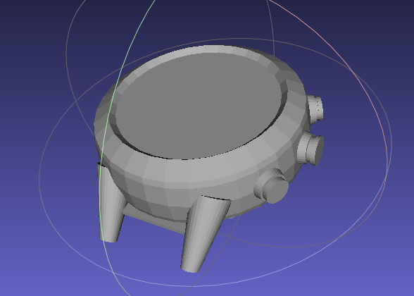

Bangle.js
=========

This directory contains Bangle.js related files, for instance the charge cradle.

* For Bangle.js pinouts and technical specs, see https://www.espruino.com/Bangle.js+Technical
* For 3D printable Bangle.js parts see https://www.thingiverse.com/search?q=bangle.js

### banglejs_dock_3mm.dxf

These are the source files for:

* https://shop.espruino.com/banglejs-dock
* https://www.youtube.com/watch?v=UvxWiyvfmpk

This should be cut out of 3mm (or slightly less) thick material.

### banglejs_form.jscad / banglejs_form.stl

A reverse-engineered form of the Bangle.js watch - good for mocking
up stands and cases, but **this is not printable as a usable watch case**
