Here we have a selection of adaptor 'shims' to connect the Espruino Pico to various other devices. Unless marked they are currently untested.

There's [a forum thread](http://forum.espruino.com/conversations/259519/) on potential adaptors. So far we have:

| Link | Type |
|------|------|
|  |  Mounting Holes |
| [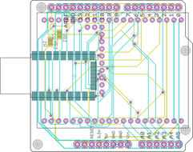](eagle/arduino.brd) |  Arduino/classic Espruino footprint |
|  |  0.05" to 0.1" adaptor |
|  |  MAX1551 LiPo battery charger |
| [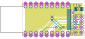](eagle/nrf24.brd) |  NRF24L01P wireless |
| [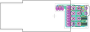](eagle/esp8266_esp01_shim_rev1.brd) | ESP8266 ESP01 Shim rev 1 |
| [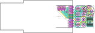](eagle/esp8266_esp01_shim_rev2.brd) | ESP8266 ESP01 Shim rev 2 - [buy on Tindie!](https://www.tindie.com/products/gfwilliams/espruino-pico-esp8266-wifi-shim/) |
| [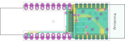(eagle/esp8266_esp12.brd) |  ESP8266 WiFi (ESP12 SMD module) |
|  |  CC3000 WiFi (would solder right on apart from GND + power) |
| [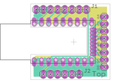](eagle/w550io.brd) |  WIZnet W5500 Ethernet - [buy on Tindie!](https://www.tindie.com/products/gfwilliams/espruino-pico-wiznet-w550io-ethernet-shim/) |
| [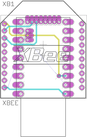](eagle/xbee.brd) |  Generic XBee footprint (will handle SRF via the XRF module) |
| [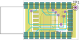](eagle/rfm12b.brd) |  RFM12B wireless |
| [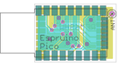](eagle/rfm69.brd) |  RFM69HW wireless |
| [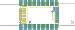](eagle/bluetooth.brd)  |  HC-05 / HC-06 / HM-10 bluetooth |
|  |  Audio Jack (see the [Audio programming thread](http://forum.espruino.com/conversations/257732/)) |
| [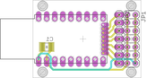](eagle/servo.brd) |  Model aircraft servos |
| [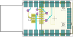](eagle/microsd.brd) |  Micro SD card |
|  |  Dual H-bridge motor driver (i'm open to ideas for something cheap and easily sourceable) |
|  |  20x4 LCD |
|  |  Wii Nunchuck |
|  |  (DrAzzy) AT24 I2C EEPROM, or AT25 SPI EEPROM - I think one or the other would be helpful? I've put EEPROMs onto the prototyping area on 2 of my 3 Espruinos - there are just so many times working with a microcontroller when you want to store just a few bytes in non-volatile memory. |
|  |  (DrAzzy) ULN2003/2803 board (put the pads for a 2803, if we want to use a 2003, it could be installed, just not using the last pair of pads), giving us 7/8 higher current outputs on 0.1" header |
|  |  (DrAzzy) SOT-23 MOSFET board - as with the ULN2003/2803, only with a buncha mosfets, with pads for a resistor between gnd and each gate for a pulldown |
|  |  (DaveCJ) [Sx1272/RFM92 868Mhz radio](http://www.ebay.co.uk/itm/HopeRF-RFM92W-915Mhz-LoRa-Ultra-Long-Range-Transceiver-SX1272-compatible-/181415801105) |
| [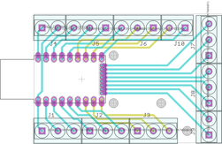](eagle/terminal.brd)  |  (DaveCJ) Screw terminals |
|  |  (allObjects) Prototyping area |
|  |  (thomc) SMT proto area (like [this](http://www.adafruit.com/product/1212)) |
|  |  (DrAzzy) A MAX31855 thermocouple interface, with spot for screw terminals to connect the thermocouple |
|  |  Soil moisture sensor |
|  |  Capacitive keypad |
|  |  [LPRS eRIC](http://www.lprs.co.uk/easy-radio/eric/) radio module |
|  |  [Seeed Grove headers](http://www.seeedstudio.com/depot/s/grovefamily.html) |
|  |  [.NET Gadgeteer](http://www.netmf.com/gadgeteer/) |
| [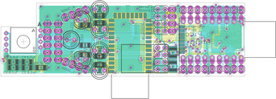](eagle/robot.brd) |  Line-following Robot (LEDs, Mouse sensor, 4x LDRs, 4x Servo, Bluetooth, WiFi) |
|  |  Simple Line-following Robot (LEDs, 4x LDRs, 2x Servo, Bluetooth) |
| [Link](../EspruBoy/espruboy.brd) | Mini-GameBoy Module |
