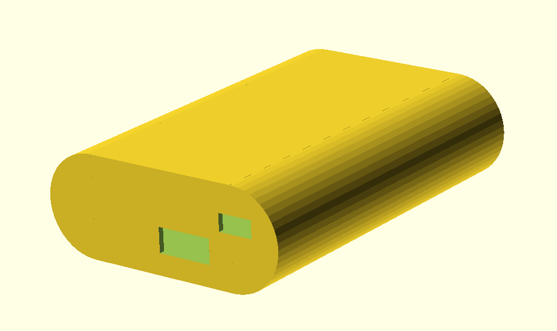
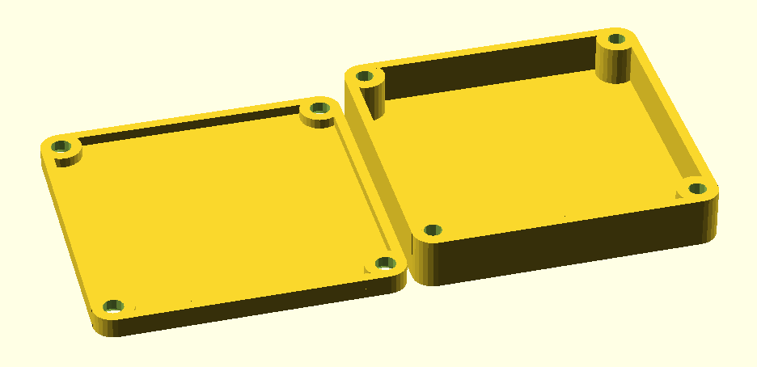
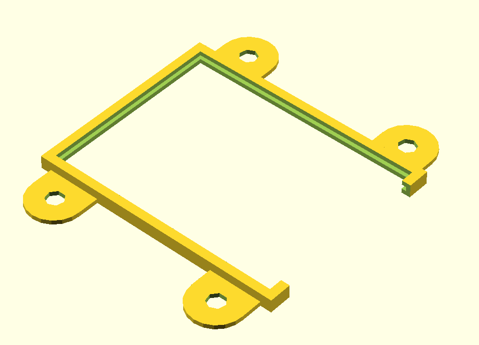
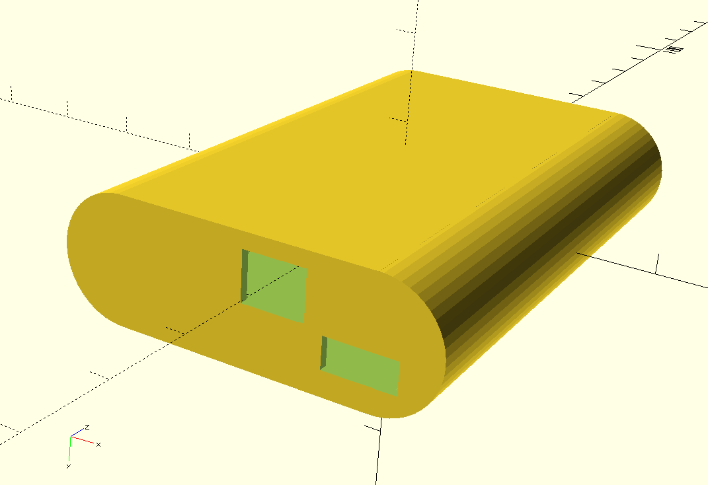
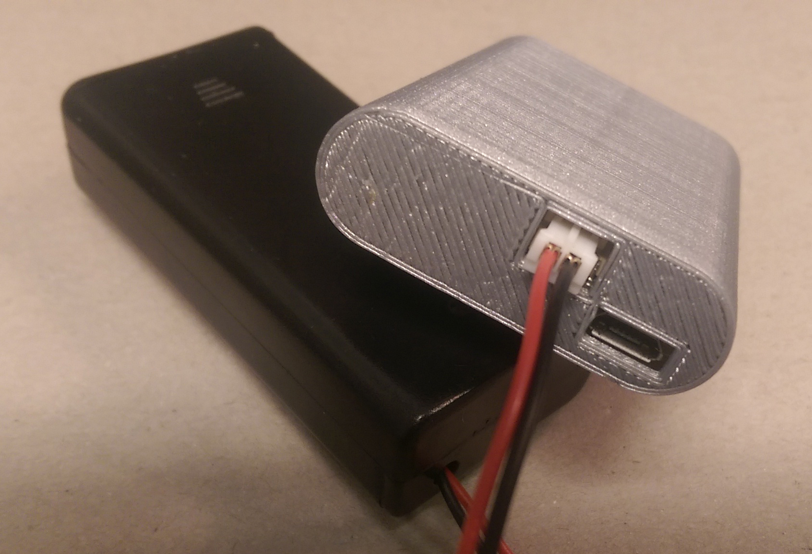
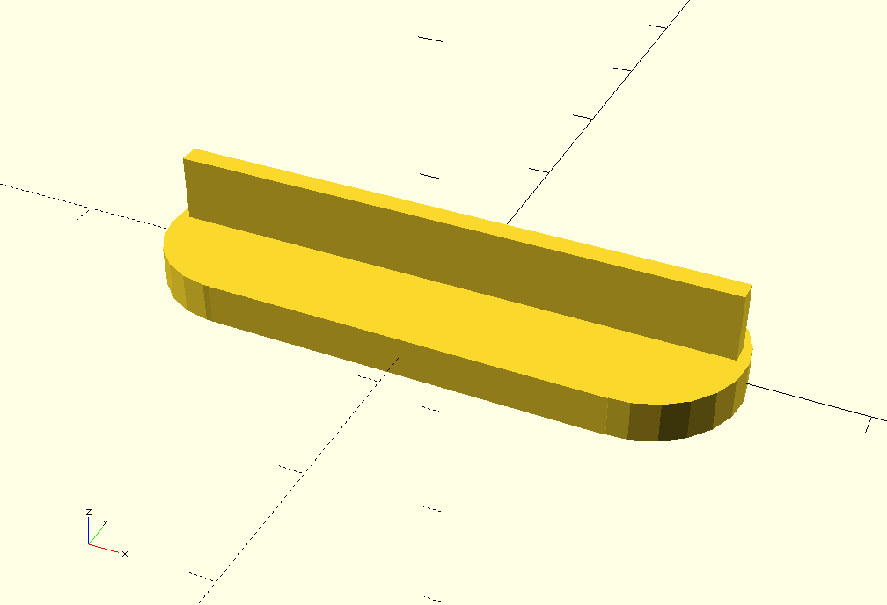
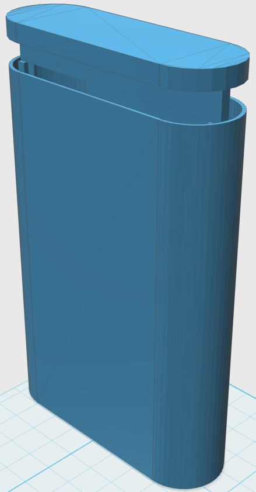
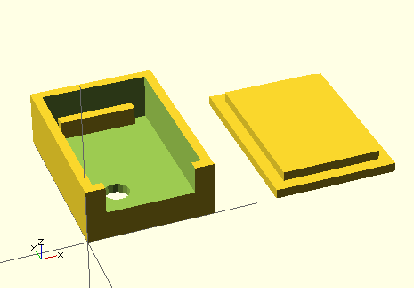
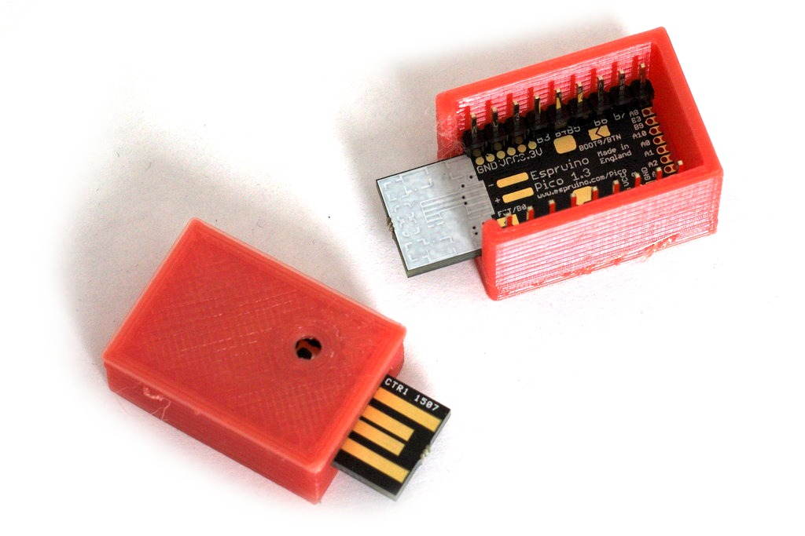

3D Printable Mounts and Boxes
=========================

Here are some boxes and holders for Espruino that you can print.

They are in [OpenSCAD](http://www.openscad.org/) format which means that they can be easily tweaked to different sizes.

STL files can be generated by running `make` in this directory. 

gcode files can be generated by saving a slic3r configuration as `slicer.ini` 
in this directory and then running `make gcode`

## Espruino version < 1.4

**BEWARE:** These have been designed on a 3D printer that is not totally calibrated, and as such could do with some adjustment before printing. Please feel free to contribute back your changes and designs.

### espruino_box.scad

### espruino_box2.scad

### espruino_box3.scad

### espruino_mount.scad

## Espruino 1.4
As Espruino 1.4 moved USB and power around a bit, be sure to print this case if you own 1.4. You can easily look it up below the large Espruino silk screen label on your board.

### espruino_box.scad

Ultimaker 2, PLA, standard quality, 250* nozze, 60* plate

This makes for a very tight fit which is what I wanted for this application, expand INNER_WIDTH if you want a looser fit in the case.

## Espruino Cover
This cover is parameterized so you can adapt it to your version of espruino_box.

### espruino_cover.scad

It slides in on the back of the espruino_cover like this:

## Espruino Pico

### pico_box.scad

